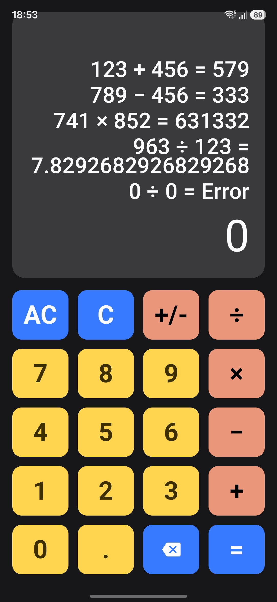
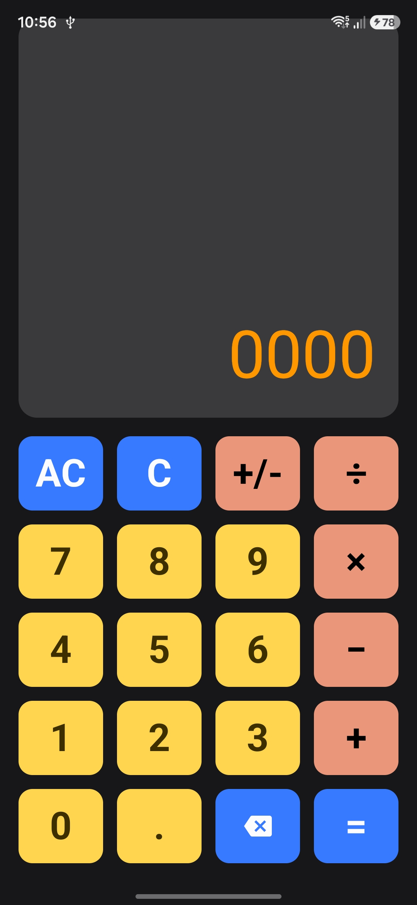
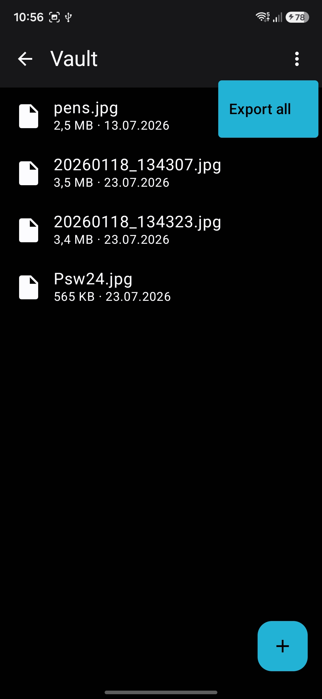

# xcalc

xcalc is an Android app built with Kotlin and Jetpack Compose. It combines a clean calculator UI with a secure encrypted file vault.

## Highlights
- Compose-based UI (Material 3).
- Calculation history and repeat-equals behavior.
- Hidden Vault with PIN protection; the PIN is entered on the calculator keypad itself, with no tell-tale PIN screen.
- File/folder import, organization, and export from Vault.
- Encryption backed by Android Keystore (`AES/GCM`).

## Screenshots
<table>
  <tr>
    <td></td>
    <td></td>
    <td></td>
  </tr>
  <tr>
    <td align="center">Calculator and history</td>
    <td align="center">PIN entry on the keypad</td>
    <td align="center">Vault contents</td>
  </tr>
</table>

## Helper Scripts
- `10-MakeRelease.sh`: build release APKs (bumps the build number).
- `11-EmulRELEASE.sh`, `12-SamsRELEASE.sh`: install release APKs with `adb`.
- `20-MakeTag.sh`, `21-PushTag.sh`, `22-RelUpload.sh`: tag a release and upload it.
- `99-CopyToAPKX.sh`: copy built APKs to the archive location.

## Note
This codebase was developed with the help of artificial intelligence tools.
